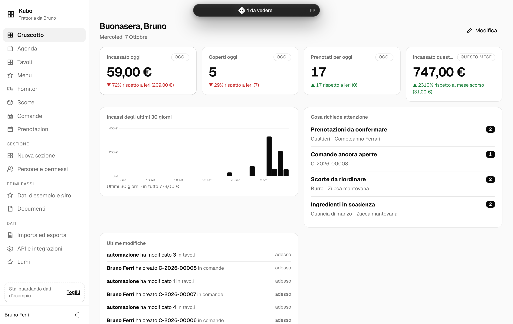
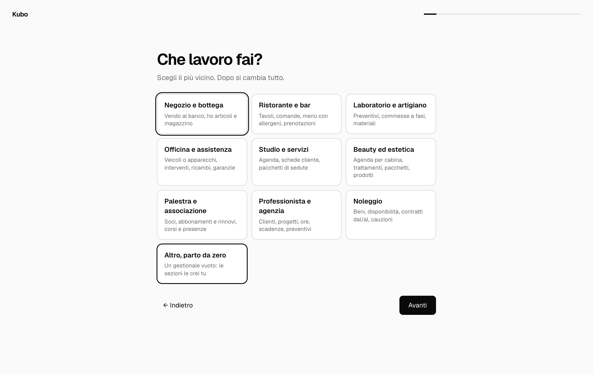
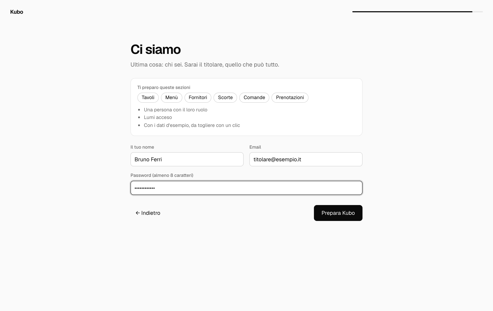
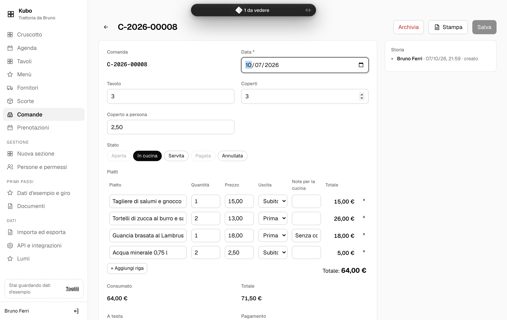
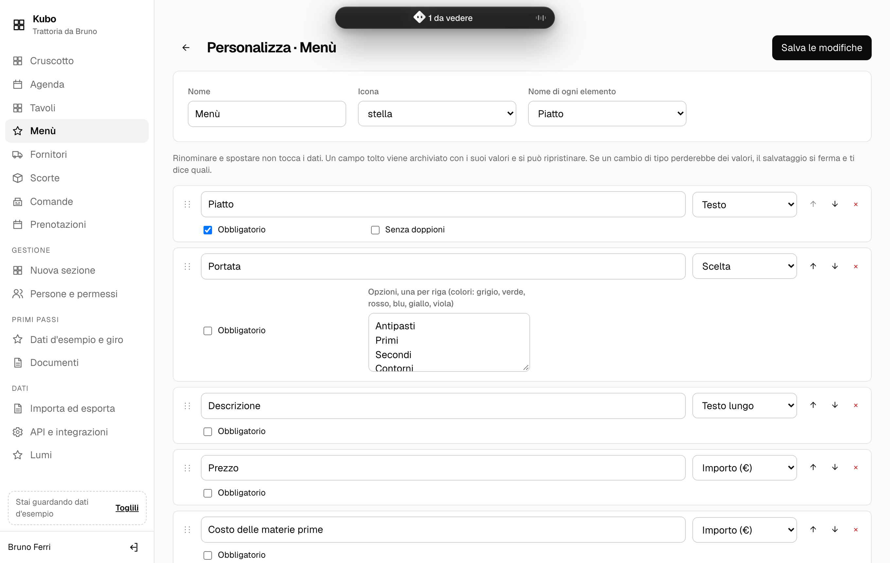

# Kubo

**Il gestionale open source che monti a modo tuo.** Rispondi a dieci domande sul tuo lavoro e Kubo prepara clienti, vendite, agenda e magazzino. Poi lo cambi da solo, senza scrivere codice. I dati restano su un tuo computer.



- **Lo monti tu.** Sezioni, campi, stati, formule alla Excel in italiano, automazioni e permessi si cambiano da **Personalizza**. Nessuna modifica perde dati: un campo tolto si archivia, un cambio di tipo che perderebbe valori si ferma e ti dice quali.
- **I dati stanno da te.** Un solo file SQLite su un PC o un piccolo server in ufficio; gli altri entrano dal browser della rete locale, anche dal telefono. Funziona senza internet.
- **C'è Lumi.** Chiedi a parole: «quanto ho incassato questa settimana?», «aggiungi la taglia agli articoli». Lumi legge con i tuoi permessi e propone; ogni modifica la confermi tu.
- **In sei lingue.** Italiano, inglese, spagnolo, francese, tedesco e portoghese del Brasile: ognuno sceglie la sua, l'azienda sceglie la valuta ([docs/LINGUE.md](docs/LINGUE.md)).

Gratis, licenza MIT, zero dipendenze: basta Node ≥ 22.5.

## Provalo in due minuti

```bash
git clone https://github.com/W1kicartel/kubo
cd kubo
npm start          # http://localhost:4380 · i dati in ./dati/kubo.db
```

Al primo avvio parte l'**avvio guidato**: il nome dell'attività, una domanda per schermata (che lavoro fai, se hai un magazzino, se prendi appuntamenti, se emetti fatture, chi lavora con te, se vuoi Lumi), e alla fine «vuoi vedere Kubo con dei dati d'esempio?». Dopo, un giro di quattro tappe ti mostra dove sono le cose. I dati d'esempio si tolgono con un clic; dove non hai ancora inserito niente, la numerazione riparte da 1.

| | |
|---|---|
|  |  |

```bash
npm start -- --rete   # anche dagli altri PC e telefoni della rete locale
npm test              # tutta la suite, senza rete
```

C'è anche l'app per il computer, che tiene i dati o si collega a un Kubo in rete, e c'è Docker per un VPS con HTTPS. Tutte e tre le strade sono in [docs/INSTALLARE.md](docs/INSTALLARE.md). I backup sono automatici: ogni giorno e prima di ogni modifica alla struttura.

## Settori pronti

Ogni modello ha sezioni, formule, automazioni, ruoli, un cruscotto suo e i dati d'esempio. Si combinano: un'officina che fa anche preventivi, una palestra che emette fatture.

| | cosa c'è | cosa fa da solo |
|---|---|---|
| **Negozio e bottega** | articoli con giacenza e scorta minima, vendite con righe, fornitori e ordini | scala il magazzino alla vendita pagata, lo ricarica al reso e all'arrivo dell'ordine |
| **Ristorante e bar** | tavoli, comande con coperto e uscite, menù con i 14 allergeni e il food cost, prenotazioni, scorte | segna il tavolo occupato e da sparecchiare, avvisa la cucina delle allergie |
| **Laboratorio e artigiano** | preventivi con voci e IVA, commesse a fasi con ore, materiali, costo e margine | il preventivo accettato apre la commessa, l'avvio scala i materiali |
| **Officina e assistenza** | veicoli e apparecchi, interventi a fasi, ore, ricambi, garanzie e revisioni | scala i ricambi una volta sola, aggiorna i km, ricorda di chiamare il cliente |
| **Studio e servizi** | agenda per persona, servizi, schede cliente, pacchetti di sedute | l'appuntamento fatto consuma una seduta |
| **Beauty ed estetica** | agenda per cabina e operatrice, trattamenti, schede, pacchetti, prodotti | conta le sedute e apre la scheda del trattamento |
| **Palestra e associazione** | soci e certificati medici, abbonamenti a tempo o a ingressi, corsi, lezioni e presenze, quote | prepara la quota dell'abbonamento e la scadenza del mensile |
| **Professionista e agenzia** | progetti con budget e ore, registro delle ore, attività e scadenze, preventivi | il preventivo accettato apre il progetto, quello inviato mette il promemoria |
| **Noleggio** | beni con la disponibilità, contratti dal/al con giorni, sconto e cauzione | i beni escono e rientrano da soli, segna la riconsegna, avvisa dei danni |
| **Fatture** | si aggiunge a tutti: numerazione per anno, IVA, ritenuta, bollo, FatturaPA | segna la data del pagamento |
| **Da zero** | nessuna sezione: le crei tu o le chiedi a Lumi | |

Per aggiungere un settore basta scrivere un file in `modelli/` (e, se vuoi, i suoi dati d'esempio in `modelli/esempi/`): vedi [docs/AVVIO.md](docs/AVVIO.md).

## Com'è fatto

| | |
|---|---|
|  |  |

- **`server/`** (Node, nessuna dipendenza): `schema.js` trasforma lo schema in tabelle senza perdite; `dati.js` fa il CRUD generico con righe figlie, calcolati e registro; poi `formule.js`, `permessi.js`, `automazioni.js`, `auth.js` (scrypt, sessioni, PIN al banco) e `api.js` (REST, eventi in tempo reale, file statici). I moduli in `server/moduli/` aggiungono agenda e cruscotto, documenti e FatturaPA, import ed export, Lumi e l'avvio guidato.
- **`web/`**: l'interfaccia in moduli ES puri, senza build, aggiornata in tempo reale quando un collega modifica.
- **`modelli/`**: i settori in JSON.
- **`sito/`**: la pagina di presentazione, pubblicata su GitHub Pages da `.github/workflows/sito.yml`.

Il disegno completo è in [docs/PROGETTO.md](docs/PROGETTO.md).

## Kubo non fa per te se…

…vuoi un numero di telefono da chiamare quando qualcosa non va e non hai nessuno che sappia installare un programma, oppure ti serve la contabilità completa (prima nota, bilancio, F24): quella resta al commercialista.

## Sicurezza e prestazioni

- Come Kubo protegge i dati, e cosa si regola da *Sicurezza*: [docs/SICUREZZA.md](docs/SICUREZZA.md).
- Quanto resta veloce con 50.000 articoli e 200.000 righe di vendita: [docs/PRESTAZIONI.md](docs/PRESTAZIONI.md).

## Licenza

MIT © W1kicartel. Il carattere Geist è © Vercel, con licenza SIL OFL 1.1.
